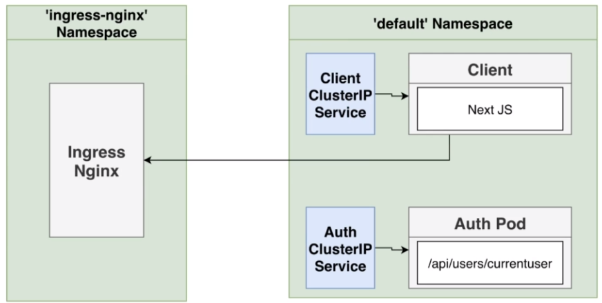

### How the Next JS will authenticate request?
* Inspect URL of incoming request. 
  Determine set of components to show depending on auth state.
* Call those component's 'getInitialProps' static method.
  For all the components that it needs to show, it will call the getInitialProps().
* Render each component with returned data.
  Render the component based on the data returned by getInitialProps().
* Assemble HTML from all components and render the response.
     
--- 

### How to communicate amongst services internally?
* We could either use 'http://auth-srv/api/users/currentuser'
  This would work but it could get complicated very quickly and 
  we would have to remember srv-names for ALL the services!
  ##### note : 
  This rule only works if the services are in the same namespace.
  ```
  kubectl get namespace
  ```
  *BUT the ingress-nginx runs in a separate 'ingress-nginx namespace'*. 
  <!--  -->
  
  Therefore, below point might be a challenge: 

* We could rather reach out to ingress-nginx with the path
  of '/api/users/currentuser and let ingress-nginx figure out 
  to which service in our cluster this request would belong to.

#### NOTE : 
  * We need to figure out a way to get to the domain on which 
    the ingress-nginx is listening. 
  * We also need to figure out a way to send along the cookies 
    to all these internal follow up requests.

---
